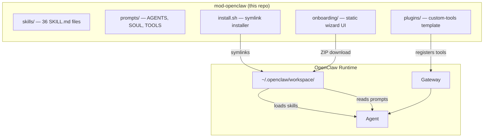
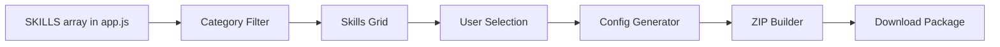
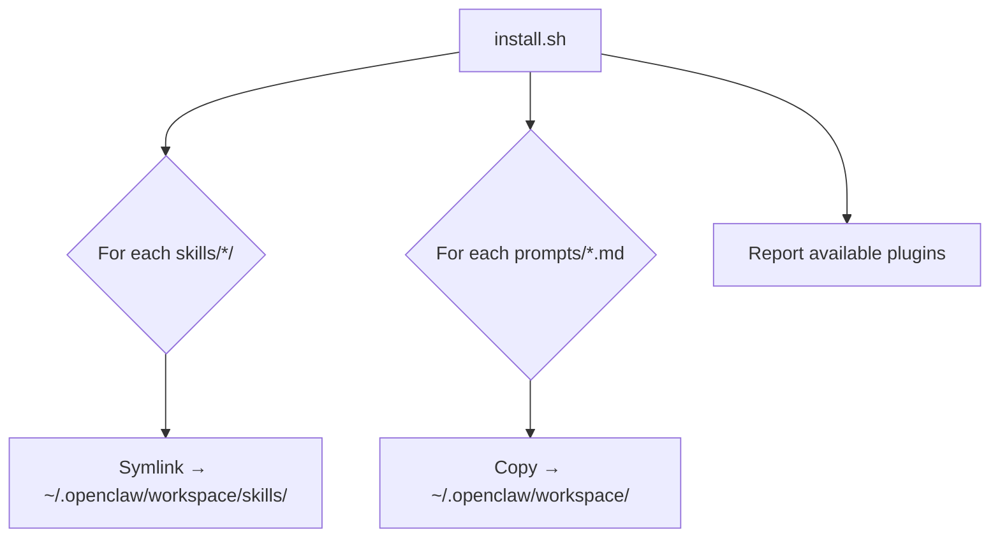
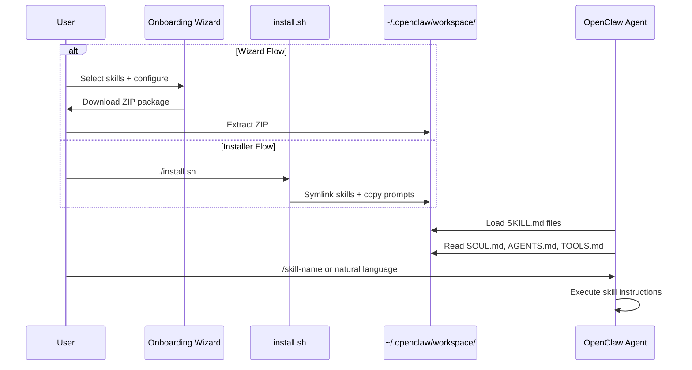

# Architecture

## Overview

mod-openclaw is a **pure extension layer** for OpenClaw. It contains no server, no database, and no Docker containers. Everything operates through OpenClaw's native extension points: skills (Markdown instructions), prompt overrides, and gateway plugins.



## Component Details

### 1. Skills (`skills/`)

Each skill is a directory containing a `SKILL.md` file with YAML frontmatter + Markdown instructions. OpenClaw auto-discovers skills from the workspace.

```
skills/<skill-name>/
├── SKILL.md          # Required: YAML frontmatter + instructions
├── scripts/          # Optional: helper scripts (bash, python)
├── install.sh        # Optional: dependency installer
└── resources/        # Optional: reference files
```

**SKILL.md format:**

```yaml
---
name: skill-name
description: What this skill does
user-invocable: true # Can be triggered with /skill-name
metadata:
  openclaw:
    emoji: "🔧"
    os: ["darwin"] # Optional: OS restriction
    requires:
      bins: ["brew"] # Optional: required binaries
triggers: # Optional: natural language triggers
  - "/skill-name <arg>"
  - "Do something..."
---
# Skill Name

## Instructions
[Markdown instructions for the agent]
```

**Skill categories and counts:**

| Category         | Count | Examples                                      |
| ---------------- | ----- | --------------------------------------------- |
| Starter          | 7     | hello-world, daily-briefing, code-reviewer    |
| Development      | 8     | tdd, ollama-local, llm-router, git-worktrees  |
| Productivity     | 5     | obsidian, invoice-organizer, meeting-analyzer |
| Research & Data  | 2     | deep-research, csv-analyzer                   |
| Creative & Media | 5     | youtube-transcript, newsletter-ideation       |
| Business         | 4     | resume-tailor, presentation-builder           |
| Apple / macOS    | 5     | homebrew, mlx-stt, apple-music                |

### 2. Prompt Overrides (`prompts/`)

Three workspace-level prompt files that customize agent behavior:

| File        | Purpose                | Key Settings                                                 |
| ----------- | ---------------------- | ------------------------------------------------------------ |
| `SOUL.md`   | Personality & tone     | Sharp, opinionated, concise. Humor OK. No corporate hedging. |
| `AGENTS.md` | Routing & instructions | TypeScript preference, confirm before destructive ops        |
| `TOOLS.md`  | Tool usage rules       | `web_fetch` over `browser`, `--dry-run` for destructive ops  |

These files are copied to `~/.openclaw/workspace/` by the installer. OpenClaw reads them at session start.

### 3. Onboarding Wizard (`onboarding/`)

A client-side single-page application (no server, no build step):

```
onboarding/
├── index.html    # 4-step wizard structure
├── app.js        # Skill inventory (36 entries), state management,
│                 #   category filter, config generation, ZIP creator
└── style.css     # Dark-mode glassmorphism design system
```

**Data flow:**



**Key implementation details:**

- **Skill inventory**: `const SKILLS = [...]` — 36 objects with id, name, emoji, author, description, tags, security, platform, source, category, config
- **Category filter**: Dynamic pill buttons generated from unique `category` values
- **Config generation**: Produces `openclaw.json` with selected skills and user preferences
- **ZIP generation**: Client-side using Compression Streams API — no external dependencies
- **State management**: Single `state` object with `currentStep`, `selectedSkills` (Set), `toggleStates`, `activeFilter`

### 4. Install Script (`install.sh`)

Bash script that connects the repo to the OpenClaw workspace:



**Environment variables:**

- `OPENCLAW_HOME` — OpenClaw home directory (default: `~/.openclaw`)
- `OPENCLAW_WORKSPACE` — Workspace path (default: `$OPENCLAW_HOME/workspace`)

### 5. Plugin Template (`plugins/custom-tools/`)

A JavaScript/TypeScript module template for registering custom gateway tools. Requires `openclaw plugins install` and a gateway restart.

## Data Flow



## Design Decisions

1. **No server** — Everything is static files. The wizard runs in the browser, the installer is a bash script, skills are Markdown.
2. **Symlinks over copies** — The installer symlinks skills so edits in the repo are instantly reflected without re-installing.
3. **Client-side ZIP** — The wizard generates ZIP files entirely in the browser using the Compression Streams API. No server upload/download needed.
4. **Category system** — Skills are tagged with categories for the filter bar. Categories are derived from the SKILLS array, not hardcoded in HTML.
5. **Merged skills** — When multiple implementations exist for the same tool (e.g., two Obsidian skills), they're merged into one comprehensive SKILL.md.
